# Clinical Context of the Four Classes

> Reference document — the medical background behind the four labels the model
> learns to distinguish. Understanding the disease behind each class is what
> lets us **(a)** reason about *why* the model confuses certain classes,
> **(b)** judge whether the XAI heatmaps (Phase 3) attend to clinically
> meaningful regions, and **(c)** present the project with real domain grounding
> rather than treating the labels as abstract categories.
>
> **Disclaimer.** This is an educational summary compiled from public medical
> sources (cited per section). It is **not medical advice**, and the image
> readings below are **pedagogical interpretations, not radiological
> diagnoses**. The dataset provides *image-level labels only* — it does not
> annotate where the tumor is. All example images are from the project's
> training set.

---

## How to read a brain MRI — shared fundamentals

Three tools apply to every image regardless of class. They are the foundation
for the per-class signs that follow.

### 1. The three planes (viewing angles)

An MRI scanner slices the head along three orthogonal orientations. The same
brain — and the same tumor — looks completely different depending on which plane
you are viewing.

| Plane | What you're looking at | How to recognize it |
|-------|------------------------|---------------------|
| **Axial** | Horizontal slices, viewed from above (top-down) | Roughly circular skull outline; front of head at top, back at bottom |
| **Coronal** | Front-to-back slices, viewed face-on | **Eye sockets / orbits** visible at the bottom mark the front of the head |
| **Sagittal** | Left-to-right slices, viewed in profile | The **profile of the face** (nose, eye) is visible from the side |

### 2. Symmetry is the primary search tool

The healthy brain is approximately **mirror-symmetric** across the vertical
midline. Most pathology — tumor, edema, bleeding — **breaks that symmetry**.
The first reading reflex is: *compare the two halves; the half that looks
"different" (darker, brighter, mis-shaped, or with its normal folds smoothed
out) is where to look.*

Symmetry works best on **axial** and **coronal** views (both show left and
right halves). On **sagittal** views you see only one side, so instead you look
for an abnormal *mass or texture* that breaks the otherwise smooth pattern.

### 3. Radiological convention (left ≠ left)

Medical images are displayed as if you are **facing the patient**. Therefore:

```
   LEFT side of the image   =   patient's RIGHT side
   RIGHT side of the image  =   patient's LEFT side
```

Like shaking hands — the other person's right hand is on your left. (Our dataset
is aggregated from multiple sources, so this convention is the sensible default
but not strictly guaranteed for every image.)

### MRI sequences (why the same tissue changes brightness)

The scanner can be tuned to different "sequences" that make the same tissues
appear with different brightness. This is the other reason the same class varies
so much across images.

| Sequence | Fluid (CSF) appears | Best for |
|----------|---------------------|----------|
| **T1** | dark | clean anatomy |
| **T2** | bright | edema / pathology |
| **FLAIR** | suppressed (dark) | highlighting lesions next to fluid |
| **T1 + contrast (gadolinium)** | tumor "lights up" | tumors that break the blood–brain barrier |

On a **T1** image a tumor and its surrounding edema tend to look **darker** than
normal brain; with **contrast**, the active parts of a tumor **brighten**.

---

## Glioma

### What it is

A **glioma** is a tumor that arises from **glial cells** — the brain's
*support cells* (astrocytes, oligodendrocytes, ependymal cells). Glial cells do
not transmit signals like neurons; they nourish, support, and protect neurons.
When one of these cells begins to multiply uncontrollably, a glioma forms.

Gliomas are the **most common** primary brain tumor, accounting for roughly
**33% of all brain tumors**.

### Grading — the WHO scale (I to IV)

The World Health Organization grades gliomas by aggressiveness:

| Grade | Behavior |
|-------|----------|
| I | Essentially benign, low risk |
| II | Low-grade, but with a notable tendency to recur |
| III | High-grade (anaplastic), malignant |
| **IV** | **Glioblastoma (GBM)** — the most aggressive form |

Grade IV glioblastoma is fast-growing and invades nearby brain tissue, though it
generally does not spread to distant organs.

### Clinical impact (what it causes)

A glioma grows **inside** the brain tissue and **compresses** the surrounding
structures — the same *mass effect* visible on MRI as flattened, effaced brain
folds. That pressure produces the symptoms. The most prevalent are:

- **Seizures** (~37%)
- **Cognitive deficits** (~36%)
- **Drowsiness** (~35%)
- **Headache** (~27%), **confusion** (~27%)
- **Aphasia** (language difficulty, ~24%), **motor deficits** (~21%)

### Prognosis

For the high-grade glioblastoma the prognosis is poor: **median survival ~15
months** from diagnosis, with a 5-year survival below 5%. This is precisely why
**early and fast diagnosis matters** — and is part of the motivation for an
automated triage tool like NeuroLens.

### How it appears on MRI — recognition checklist

Built from the three example images below. A glioma typically shows:

| Sign | What to look for |
|------|------------------|
| **Broken symmetry** | one half of the brain looks different from the other |
| **Dark mass** | region darker than normal tissue (on T1) |
| **Mass effect** | normal brain folds (sulci) flattened/effaced on one side |
| **Ill-defined border** | no clean boundary — the tumor *infiltrates* (blurry edge) |
| **Heterogeneous interior** | mixed dark + bright patches (necrosis + active tumor) |
| **Any location** | no fixed anatomical address — can appear anywhere in the brain |

The key intuition: a glioma is rarely a neat ball. It **infiltrates**, so what
you often detect is not the tumor itself but the **damage it causes**
(asymmetry, effaced folds, a dark blurry region). When a high-grade tumor grows
faster than its blood supply, its center dies (**necrosis**, appears dark) while
its edges stay active (**enhance bright** with contrast) — producing the
characteristic *heterogeneous* or *ring-enhancing* appearance.

### Example images (from the training set)

Three clear "textbook" examples — one per imaging plane — followed by one
deliberately hard case.

**1. Coronal view — all signs at once.** Face-on slice (eye sockets visible at
the bottom). On the image's right (the patient's left) there is a **ring-shaped
mass**: a bright enhancing rim around a darker heterogeneous center. It breaks
the brain's left–right **symmetry** plainly, and pushes the nearby ventricle —
**mass effect**. This single image shows asymmetry, ring enhancement, and mass
effect together.

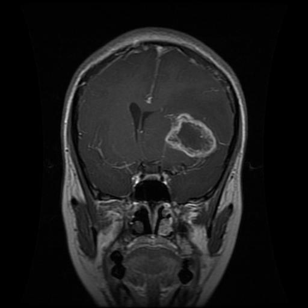

**2. Axial view — large mass displacing structures.** Top-down slice. A large,
well-defined round mass on the image's left (patient's right) shoves the normal
midline structures and ventricles toward the opposite side — a dramatic example
of **mass effect** and broken symmetry.

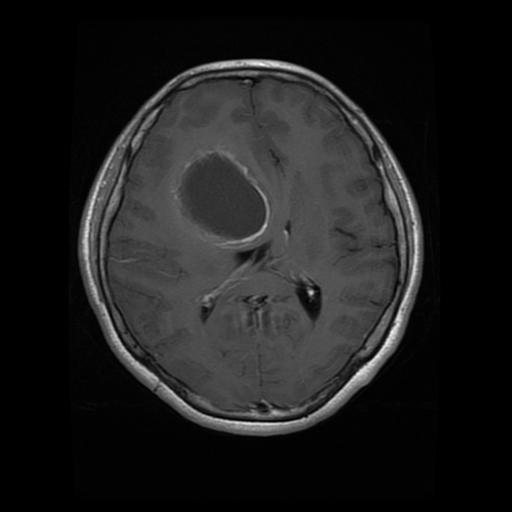

**3. Sagittal view — heterogeneous interior.** Side profile (eye and nose
visible). The mass is a rounded, **blotchy** region with an **ill-defined
border** — the infiltrative, heterogeneous texture (mixed necrosis and active
tumor) discussed above.

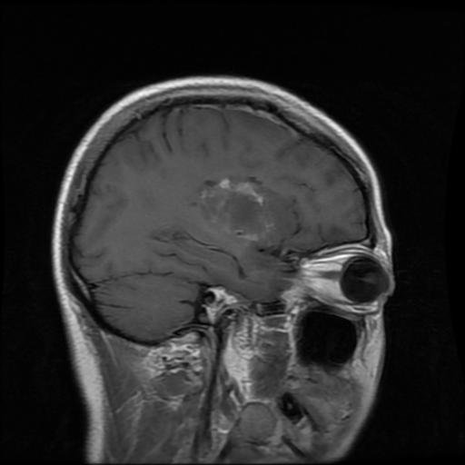

**4. A hard case — coronal view.** Not every glioma is obvious. Here you have to
*hunt* for it: compare the two halves and notice a subtle asymmetric darker
region with slightly effaced (flattened) folds on one side. This is the honest
reality — and exactly why glioma is the model's hardest class.

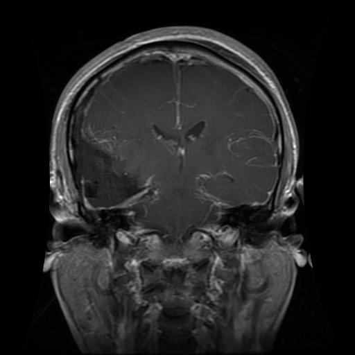

Four images, four appearances (coronal ring, axial mass, sagittal blotch, subtle
coronal), **one disease**. This variability — from "screams at you" to "you have
to hunt" — is exactly why glioma is the hardest class for the model to learn.

### Relevance to NeuroLens

- **Aggressive + time-critical** (GBM ~15-month median survival) → motivates an
  automated MRI triage tool with real clinical value.
- **Morphologically variable** (four very different appearances above) → this
  is the model's **hardest class**, reflected in its lowest per-class score
  (F1 ≈ 0.90 in the Phase 1 single-fold result). The model must learn the
  *concept* of glioma, not a fixed appearance — which is why it needs ~1,400
  training examples.
- **Richest XAI target** (Phase 3) → because the model struggles most here,
  glioma is where Grad-CAM / LIME / SHAP will be most revealing. Knowing the
  radiological signs above lets us **audit** whether the model attends to
  clinically meaningful regions or to spurious cues.

### Sources

- [Gliomas — Johns Hopkins Medicine](https://www.hopkinsmedicine.org/health/conditions-and-diseases/gliomas)
- [Glioblastoma Multiforme — American Association of Neurological Surgeons (AANS)](https://www.aans.org/patients/conditions-treatments/glioblastoma-multiforme/)
- [Glioblastoma Multiforme — StatPearls, NCBI Bookshelf](https://www.ncbi.nlm.nih.gov/books/NBK558954/)
- [Prevalence of symptoms in glioma patients throughout the disease trajectory — NCBI](https://www.ncbi.nlm.nih.gov/pmc/articles/PMC6267240/)

---

## Meningioma

### What it is

A **meningioma** arises from **arachnoid cap cells** — cells in the *arachnoid
mater*, the middle of the three membrane layers (the **meninges**) that wrap the
brain. Because it grows *from the membrane inward*, a meningioma sits **outside**
the brain tissue (**extra-axial**) and pushes the brain inward, rather than
infiltrating it from within like a glioma.

The diagram below shows where these layers sit — and therefore where a
meningioma originates (the arachnoid, just under the dura, hugging the outside
of the brain):

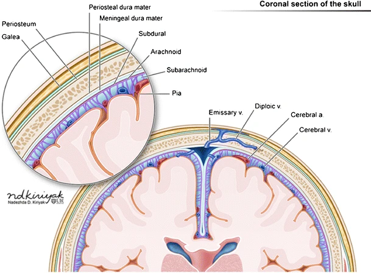

*Coronal section showing, from outside in: scalp/galea, skull, periosteal and
meningeal dura mater, subdural space, **arachnoid** (where meningiomas arise),
subarachnoid space (CSF), and pia mater against the brain. Illustration by
Nadezdha D. Kiriyak and Gwendolyn Mack, [Wikimedia Commons](https://commons.wikimedia.org/wiki/File:Illustration_demonstrating_the_layers_of_scalp,_skull,_meninges_and_brain_on_a_coronal_section.webp),
CC BY 4.0.*

It is the **most common primary brain tumor**, more frequent in women, and is
often discovered **incidentally** (found on a scan done for another reason, with
no symptoms).

### Grading — the WHO scale (mostly benign)

Unlike glioma, meningioma is **predominantly benign**:

| Grade | Behavior | Share of cases | 5-year survival |
|-------|----------|----------------|-----------------|
| **1** | **Benign** | **80%** | **92%** |
| 2 | Atypical (intermediate) | 18% | 78% |
| 3 | Anaplastic (malignant) | 2% | 47% |

This is the opposite end of the spectrum from glioblastoma (~15-month median
survival) — yet, as the images show, meningioma is the *brighter*, more
striking-looking tumor. Appearance does not equal severity.

### How it appears on MRI — recognition checklist

The mirror image of the glioma checklist:

| Sign | What to look for |
|------|------------------|
| **Extra-axial (peripheral)** | sits at the brain's edge, attached to skull/dura — not deep inside |
| **Well-defined border** | clean, rounded edge you could trace with a circle (vs glioma's blurry infiltration) |
| **Homogeneous bright enhancement** | uniform brightness with contrast (vs glioma's blotchy necrosis) |
| **Broad base against dura** | attached along the membrane, pushing the brain inward |
| **Dural tail sign** | a tapering thickening of the dura extending from the tumor (see below) |

**Why it lights up so uniformly.** The brightness is the contrast agent
(gadolinium) accumulating in the tumor. A meningioma is highly vascular *and*
lives **outside the blood–brain barrier**, so contrast floods in freely; being
solid (no necrosis), it fills evenly → **homogeneous bright** enhancement. A
high-grade glioma sits inside the barrier and has a dead necrotic center, so it
enhances **heterogeneously** (bright rim, dark core). **Bright ≠ malignant** — a
benign meningioma can outshine a malignant glioma.

**The dural tail sign.** A classic (and nearly characteristic) clue: the dura
adjacent to the tumor thickens and **tapers off** as it leaves the tumor base.
Seen in ~60–72% of meningiomas on contrast-enhanced MRI. On a 2D slice cutting
through the base, the thickening appears to taper away on *both* sides of the
attachment point. The tail also reveals *where* the tumor was born — along the
falx (a falcine meningioma) or under the skull (a convexity meningioma).

### Example images (from the training set — real, not augmented)

> All examples below are **real** scans (`Tr-me_*`). The dataset's augmented
> meningioma images (`Tr-aug-me_*`) are deliberately excluded from teaching —
> see [`dataset.md`](dataset.md#known-limitations) for why this matters.

**1. Classic case — sagittal view.** A large, bright, round, **well-defined**
mass sitting at the periphery against the inner skull, pushing the brain inward.
Clean border, uniform brightness — the textbook meningioma.

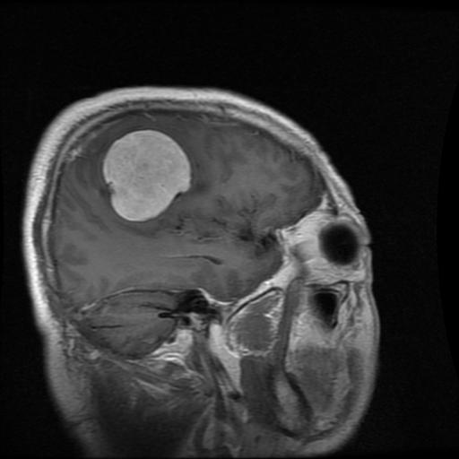

**2. Coronal view.** A bright, sharply-bordered enhancing mass — note how
distinct its edge is compared with a glioma's blurry boundary.

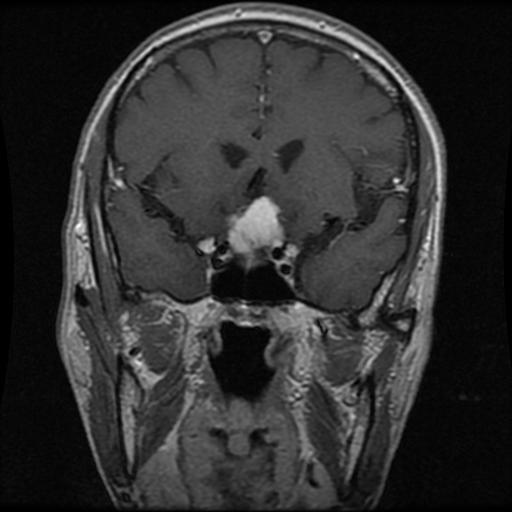

**3. Falcine meningioma — axial view.** Top-down view. The mass sits beside the
midline, attached to the **falx cerebri** (the dural sheet between the
hemispheres). The bright line running from the tumor toward the midline is the
thickened falx — a **dural tail** pointing to where the tumor originated.

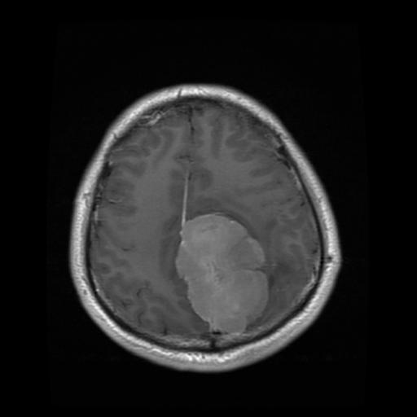

**4. Convexity meningioma — dural tail on both sides.** A small, round mass
against the inner skull. Where the slice cuts through its base, the thickened
dura **tapers off on both sides** of the attachment — the dural tail seen in
cross-section (not two separate tails, but one thickening viewed end-on).

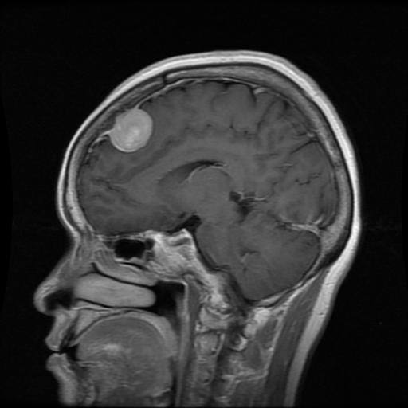

### Relevance to NeuroLens

- **Clear visual signature** (bright + round + peripheral + dural tail) → in
  principle an *easier* class than glioma. Its Phase 1 single-fold F1 (≈ 0.93)
  sat between glioma (0.90) and pituitary (0.99).
- **Carries an asterisk, though.** ~26% of the meningioma *test* images are
  synthetic (augmented). Its F1 may be **inflated** and deserves a clean
  re-evaluation on real-only test data — see [`dataset.md`](dataset.md#known-limitations).
- **Opposite severity from glioma.** Clinically, confusing a glioma (often
  urgent) with a meningioma (often benign, sometimes just monitored) is a
  serious error. This class pair is worth scrutinizing in the confusion matrix
  and in the Phase 3 XAI analysis.

### Sources

- [Meningiomas — American Association of Neurological Surgeons (AANS)](https://www.aans.org/patients/conditions-treatments/meningiomas/)
- [Meningioma — Johns Hopkins Medicine](https://www.hopkinsmedicine.org/health/conditions-and-diseases/meningioma)
- [Meningioma — StatPearls, NCBI Bookshelf](https://www.ncbi.nlm.nih.gov/books/NBK560538/)
- [A review on dural tail sign — NCBI](https://pmc.ncbi.nlm.nih.gov/articles/PMC2999017/)

## Pituitary tumor

### What it is

A pituitary tumor (almost always a **pituitary adenoma**) arises from the
**pituitary gland** — the body's "master gland," which controls other glands
through hormones. It sits in the **sella turcica**, a small bony hollow at the
**center base of the brain**, just behind the nose and below the optic nerves.

It is the **fourth most common** intracranial tumor (after glioma, meningioma,
and schwannoma), most often appears in people in their **30s–40s**, and the
large majority are **benign and slow-growing**.

### The twist — this tumor "speaks" through hormones

Unlike glioma (which causes symptoms by *compressing* brain tissue), a pituitary
adenoma often causes symptoms through **chemistry**. It comes in two types:

| Type | Behavior | How it presents |
|------|----------|-----------------|
| **Functioning** | Produces excess hormone | Hormonal symptoms *before* it grows large |
| **Non-functioning** | Produces no hormone | Grows silently until it compresses something |

About **58% of patients present with symptoms of hormone excess** — e.g.,
Cushing's syndrome (high cortisol), acromegaly (high growth hormone), or high
prolactin. A small tumor can therefore have a body-wide effect.

### The classic compression symptom — vision

Directly **above** the sella turcica runs the **optic chiasm** (where the eyes'
nerves cross). When the tumor grows upward (**suprasellar extension**), it
pushes on the chiasm and the patient loses **peripheral (side) vision** —
*bitemporal hemianopsia*. This is a hallmark presentation of a pituitary
macroadenoma.

### How it appears on MRI — recognition checklist

For pituitary, **location is the dominant signal** — you don't need to hunt for
border or texture cues:

| Sign | What to look for |
|------|------------------|
| **Fixed central-base location** | always in the sella turcica — midline, base of brain, behind the nose |
| **Best seen sagittal + coronal** | the pituitary-dedicated MRI views; the mass sits dead-center |
| **Enhances with contrast** | the pituitary region is *outside* the blood–brain barrier (it must exchange hormones with the blood), so contrast floods in → bright |
| **Possible suprasellar extension** | a larger adenoma bulges upward toward the optic chiasm; a "snowman"/figure-8 shape on coronal views |

**Why it lights up.** Same mechanism as the meningioma: the brightness is
contrast (gadolinium) accumulating where there is no blood–brain barrier. For
the pituitary, that absence is **functional** — the gland needs fenestrated
("leaky") vessels to release and sense hormones in the bloodstream. Brightness
depends on whether contrast was used: a non-contrast T1 of the same tumor looks
gray, not white.

### Example images (from the training set — all real)

**1. Sagittal view.** Profile slice through the midline. The mass sits at the
center base, in the sella turcica behind the nose — the fixed pituitary
location. (Non-contrast here, so it reads gray rather than bright.)

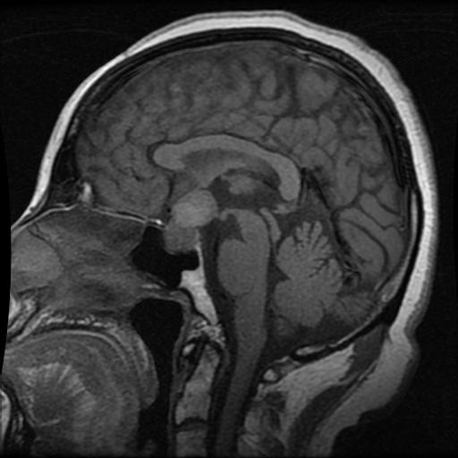

**2. Axial view.** Top-down. A bright, round, well-defined mass dead-center at
the base of the brain — the contrast-enhanced appearance.

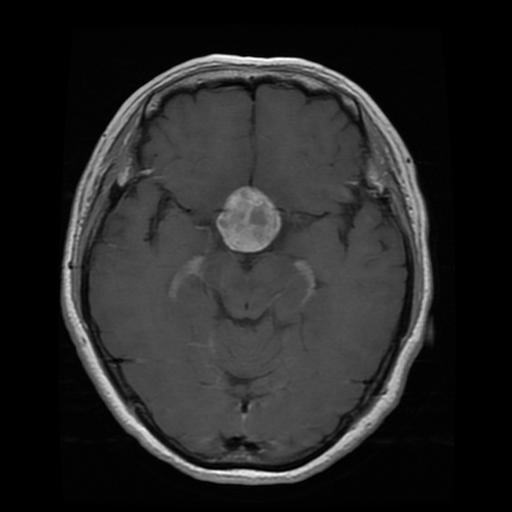

**3. Coronal view.** Face-on. The mass sits in the midline at the skull base and
bulges upward out of the sella — the suprasellar direction, toward the optic
chiasm.

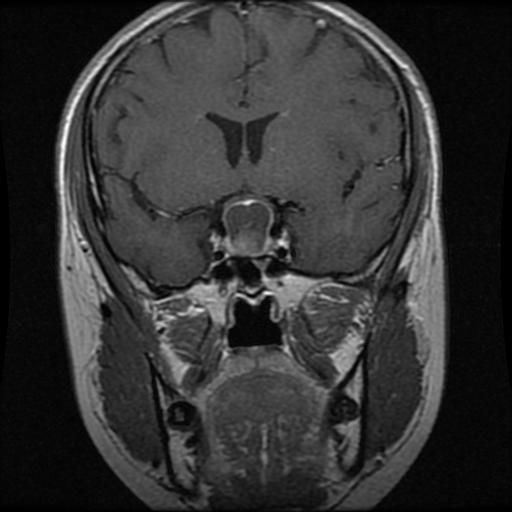

Across all three planes the mass is in the **same place** — the sella turcica.
That positional consistency is the whole story of this class.

### Relevance to NeuroLens

- **Fixed location → easiest class.** Its Phase 1 single-fold F1 (≈ 0.99) is the
  highest of the four. The model essentially learns "mass at the center base =
  pituitary" and rarely misses.
- **Best positive control for the XAI** (Phase 3). The pituitary's Grad-CAM
  should be tightly focused on the sella turcica. If the model attends there, it
  is strong evidence it learned anatomy rather than a spurious shortcut — making
  pituitary our cleanest check that the explanations are trustworthy.
- **The pedagogical contrast with glioma.** Pituitary (fixed position, F1 0.99)
  vs glioma (no fixed position, F1 0.90) illustrates exactly *why* positional
  predictability makes a class easy to classify.

### Sources

- [Pituitary Adenomas — American Association of Neurological Surgeons (AANS)](https://www.aans.org/patients/conditions-treatments/pituitary-adenomas/)
- [Pituitary Adenoma — StatPearls, NCBI Bookshelf](https://www.ncbi.nlm.nih.gov/books/NBK554451/)
- [Imaging of pituitary tumors (5th WHO Classification) — NCBI](https://pmc.ncbi.nlm.nih.gov/articles/PMC10366012/)

## No tumor (negative class)

_To be documented._
