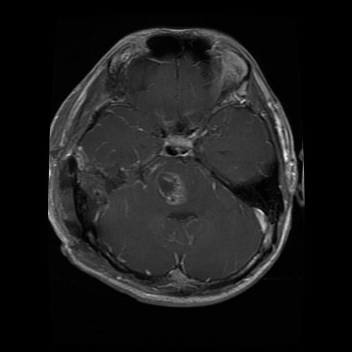

# Clinical Context of the Four Classes

> Reference document — the medical background behind the four labels the model
> learns to distinguish. Understanding the disease behind each class is what
> lets us **(a)** reason about *why* the model confuses certain classes,
> **(b)** judge whether the XAI heatmaps (Phase 3) attend to clinically
> meaningful regions, and **(c)** present the project with real domain grounding
> rather than treating the labels as abstract categories.
>
> **Disclaimer.** This is an educational summary compiled from public medical
> sources (cited per section). It is **not medical advice**, and the image
> readings below are **pedagogical interpretations, not radiological
> diagnoses**. The dataset provides *image-level labels only* — it does not
> annotate where the tumor is. All example images are from the project's
> training set.

---

## How to read a brain MRI — shared fundamentals

Three tools apply to every image regardless of class. They are the foundation
for the per-class signs that follow.

### 1. The three planes (viewing angles)

An MRI scanner slices the head along three orthogonal orientations. The same
brain — and the same tumor — looks completely different depending on which plane
you are viewing.

| Plane | What you're looking at | How to recognize it |
|-------|------------------------|---------------------|
| **Axial** | Horizontal slices, viewed from above (top-down) | Roughly circular skull outline; front of head at top, back at bottom |
| **Coronal** | Front-to-back slices, viewed face-on | **Eye sockets / orbits** visible at the bottom mark the front of the head |
| **Sagittal** | Left-to-right slices, viewed in profile | The **profile of the face** (nose, eye) is visible from the side |

### 2. Symmetry is the primary search tool

The healthy brain is approximately **mirror-symmetric** across the vertical
midline. Most pathology — tumor, edema, bleeding — **breaks that symmetry**.
The first reading reflex is: *compare the two halves; the half that looks
"different" (darker, brighter, mis-shaped, or with its normal folds smoothed
out) is where to look.*

Symmetry works best on **axial** and **coronal** views (both show left and
right halves). On **sagittal** views you see only one side, so instead you look
for an abnormal *mass or texture* that breaks the otherwise smooth pattern.

### 3. Radiological convention (left ≠ left)

Medical images are displayed as if you are **facing the patient**. Therefore:

```
   LEFT side of the image   =   patient's RIGHT side
   RIGHT side of the image  =   patient's LEFT side
```

Like shaking hands — the other person's right hand is on your left. (Our dataset
is aggregated from multiple sources, so this convention is the sensible default
but not strictly guaranteed for every image.)

### MRI sequences (why the same tissue changes brightness)

The scanner can be tuned to different "sequences" that make the same tissues
appear with different brightness. This is the other reason the same class varies
so much across images.

| Sequence | Fluid (CSF) appears | Best for |
|----------|---------------------|----------|
| **T1** | dark | clean anatomy |
| **T2** | bright | edema / pathology |
| **FLAIR** | suppressed (dark) | highlighting lesions next to fluid |
| **T1 + contrast (gadolinium)** | tumor "lights up" | tumors that break the blood–brain barrier |

On a **T1** image a tumor and its surrounding edema tend to look **darker** than
normal brain; with **contrast**, the active parts of a tumor **brighten**.

---

## Glioma

### What it is

A **glioma** is a tumor that arises from **glial cells** — the brain's
*support cells* (astrocytes, oligodendrocytes, ependymal cells). Glial cells do
not transmit signals like neurons; they nourish, support, and protect neurons.
When one of these cells begins to multiply uncontrollably, a glioma forms.

Gliomas are the **most common** primary brain tumor, accounting for roughly
**33% of all brain tumors**.

### Grading — the WHO scale (I to IV)

The World Health Organization grades gliomas by aggressiveness:

| Grade | Behavior |
|-------|----------|
| I | Essentially benign, low risk |
| II | Low-grade, but with a notable tendency to recur |
| III | High-grade (anaplastic), malignant |
| **IV** | **Glioblastoma (GBM)** — the most aggressive form |

Grade IV glioblastoma is fast-growing and invades nearby brain tissue, though it
generally does not spread to distant organs.

### Clinical impact (what it causes)

A glioma grows **inside** the brain tissue and **compresses** the surrounding
structures — the same *mass effect* visible on MRI as flattened, effaced brain
folds. That pressure produces the symptoms. The most prevalent are:

- **Seizures** (~37%)
- **Cognitive deficits** (~36%)
- **Drowsiness** (~35%)
- **Headache** (~27%), **confusion** (~27%)
- **Aphasia** (language difficulty, ~24%), **motor deficits** (~21%)

### Prognosis

For the high-grade glioblastoma the prognosis is poor: **median survival ~15
months** from diagnosis, with a 5-year survival below 5%. This is precisely why
**early and fast diagnosis matters** — and is part of the motivation for an
automated triage tool like NeuroLens.

### How it appears on MRI — recognition checklist

Built from the three example images below. A glioma typically shows:

| Sign | What to look for |
|------|------------------|
| **Broken symmetry** | one half of the brain looks different from the other |
| **Dark mass** | region darker than normal tissue (on T1) |
| **Mass effect** | normal brain folds (sulci) flattened/effaced on one side |
| **Ill-defined border** | no clean boundary — the tumor *infiltrates* (blurry edge) |
| **Heterogeneous interior** | mixed dark + bright patches (necrosis + active tumor) |
| **Any location** | no fixed anatomical address — can appear anywhere in the brain |

The key intuition: a glioma is rarely a neat ball. It **infiltrates**, so what
you often detect is not the tumor itself but the **damage it causes**
(asymmetry, effaced folds, a dark blurry region). When a high-grade tumor grows
faster than its blood supply, its center dies (**necrosis**, appears dark) while
its edges stay active (**enhance bright** with contrast) — producing the
characteristic *heterogeneous* or *ring-enhancing* appearance.

### Example images (from the training set)

**1. Subtle case — coronal view.** You have to hunt for it: compare the two
halves and notice the asymmetric darker region with effaced folds on one side.


**2. Obvious case — sagittal view.** Side profile (eye and nose visible). The
mass is unmistakable: a rounded, blotchy region with an ill-defined border that
breaks the smooth brain pattern.


**3. Ring-enhancing case — axial view.** Top-down view. A ring lesion with a
**bright active rim** and a **dark necrotic center** — the classic high-grade
glioma signature. (The bright star-shaped structure above it is normal CSF
around the brainstem, not tumor.)



Three images, three appearances (subtle-coronal, blotchy-sagittal, ring-axial),
**one disease**. This variability is exactly why glioma is the hardest class for
the model to learn.

### Relevance to NeuroLens

- **Aggressive + time-critical** (GBM ~15-month median survival) → motivates an
  automated MRI triage tool with real clinical value.
- **Morphologically variable** (three very different appearances above) → this
  is the model's **hardest class**, reflected in its lowest per-class score
  (F1 ≈ 0.90 in the Phase 1 single-fold result). The model must learn the
  *concept* of glioma, not a fixed appearance — which is why it needs ~1,400
  training examples.
- **Richest XAI target** (Phase 3) → because the model struggles most here,
  glioma is where Grad-CAM / LIME / SHAP will be most revealing. Knowing the
  radiological signs above lets us **audit** whether the model attends to
  clinically meaningful regions or to spurious cues.

### Sources

- [Gliomas — Johns Hopkins Medicine](https://www.hopkinsmedicine.org/health/conditions-and-diseases/gliomas)
- [Glioblastoma Multiforme — American Association of Neurological Surgeons (AANS)](https://www.aans.org/patients/conditions-treatments/glioblastoma-multiforme/)
- [Glioblastoma Multiforme — StatPearls, NCBI Bookshelf](https://www.ncbi.nlm.nih.gov/books/NBK558954/)
- [Prevalence of symptoms in glioma patients throughout the disease trajectory — NCBI](https://www.ncbi.nlm.nih.gov/pmc/articles/PMC6267240/)

---

## Meningioma

_To be documented next._

## Pituitary tumor

_To be documented._

## No tumor (negative class)

_To be documented._
