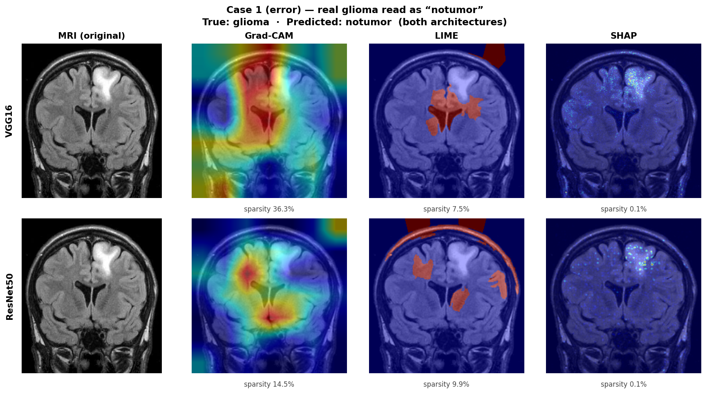
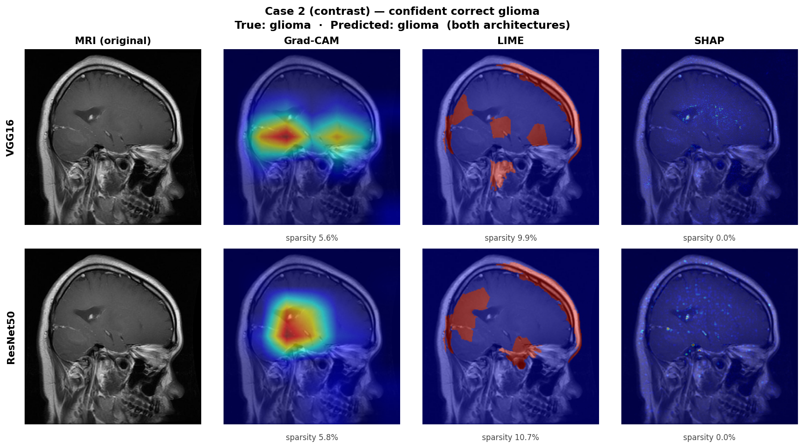

# Explainability — how Grad-CAM, LIME and SHAP explain a decision

> Reference document — explains the **mechanism** of the explainability (XAI)
> techniques used in [Phase 3](../phases/phase-3-xai.md). It assumes the CNN
> internals described in [`model.md`](model.md) (convolution, feature maps,
> backbone/head). **Grad-CAM**, **LIME** and **SHAP** are documented below.

---

## The question XAI answers

A trained model gives a confident answer — *"notumor: 71%"* — but classification
alone hides the reasoning. Two failures look identical from the outside: a model
that looked at the tumor and a model that looked at an unrelated structure can
both output the same label. For a medical baseline that is not good enough; we
need to see **where** the model looked and decide whether to trust it.

The three techniques answer that same question — *where did the evidence come
from?* — from independent angles. **Grad-CAM** reads the network from the inside
(gradients); **LIME** probes it from the outside (hiding regions); **SHAP**
attributes a fair contribution to each pixel. Their agreement (or disagreement)
in Phase 3 is what makes the analysis trustworthy: no single map is taken on
faith.

---

## Grad-CAM — from a decision to a heatmap

Grad-CAM (Gradient-weighted Class Activation Mapping) produces a heatmap over the
input MRI showing which regions most drove the predicted class. It is a
**white-box** method: it needs access to the network's internals.

### The premise: feature maps are what Grad-CAM reads

Grad-CAM does not look at the raw image. It reads the **last convolutional
layer** of the backbone. From [`model.md`](model.md#how-convolution-and-pooling-actually-work),
recall that a convolution filter slides across its input and, at each position,
multiplies-and-sums to produce one number; sliding it everywhere produces a
**feature map** marking where that filter's pattern occurs. A convolutional
layer runs many filters in parallel, so its output is a **stack of feature
maps** — for VGG16's last block, **512 maps of 7×7**; for ResNet50's `layer4`,
**2048 maps of 7×7**.


*One feature map being built: the filter (cyan box) slides over the image; each
position's multiply-and-sum lands one value in the activation map on the right.
Grad-CAM reads the **stack** of these maps from the last conv layer — the last
place in the network that still knows both **what** was detected and **where**.*

This dual property is the whole reason Grad-CAM targets that specific layer:

| Where you read | Knows **what**? (concept) | Knows **where**? (position) |
|----------------|---------------------------|-----------------------------|
| First conv layer | ✗ only raw edges, no concept | ✓ exact position |
| **Last conv layer** | ✓ "tumor-like texture" | ✓ "…here in this 7×7 region" |
| Final decision (post-head) | ✓ "notumor: 71%" | ✗ position discarded |

The head flattens (VGG16) or globally averages (ResNet50) the feature maps to
decide, which throws away location — see
[`model.md`](model.md#global-average-pooling-and-why-the-head-is-small). The last
conv layer is therefore the last point that retains a spatial grid, and Grad-CAM
exploits it.

### The six-step recipe

```
1. FORWARD    run the image through the backbone; keep the last layer's
              feature maps  A₁ … A₅₁₂   (each 7×7)                 [model.md: forward]

2. BACKWARD   for the target class score, compute the gradient w.r.t. each
              map, then average it → one importance weight αₖ per map

3. COMBINE    weighted sum of the maps:  L = Σₖ  αₖ · Aₖ            [weights, model.md]

4. ReLU       L = max(0, L)  — keep only evidence FOR the class    [ReLU, model.md]

5. UPSAMPLE   stretch the 7×7 result up to 224×224

6. OVERLAY    blend the heatmap over the original MRI (warm = high)
```

**Steps 1 and 2 are the two halves of the name.** The *forward* pass yields the
maps — *what and where*. The *backward* pass answers *which of those maps
mattered for this specific image*: the gradient of the class score with respect
to a feature map is that map's sensitivity — nudge the map up, does the class
score rise (positive, evidence for), fall (negative, evidence against), or stay
put (zero, irrelevant)? Global-average-pooling that gradient gives a single
importance weight `αₖ`. It behaves like the learned weights from
[`model.md`](model.md#how-convolution-and-pooling-actually-work), but computed
**per image** — which is why two different scans produce different heatmaps.

#### A worked example with three maps

Suppose the backbone produced just three feature maps `A`, `B`, `C`, and the
backward pass returned these importance weights:

| Map | Weight `αₖ` | Reading |
|-----|-------------|---------|
| `A` | **+3** | strong evidence **for** the class |
| `B` | **0** | did not matter for this image |
| `C` | **−2** | evidence **against** the class |

Step 3 (combine) is literally:

```
L  =  3·A  +  0·B  +  (−2)·C
      └──┘    └──┘    └────┘
   A lights   B drops   C pushes
   up fully   out       negative
```

Step 4 (ReLU) then clips everything `C` pushed below zero back to zero, so the
final heatmap is essentially **where map `A` was active**. Because `A` is a 7×7
grid that still encodes position, the hot region lands on the exact part of the
image that drove the decision. Evidence *against* the class (`C`) never lights up
— a direct consequence of the ReLU in step 4, and the reason Grad-CAM only ever
shows support *for* the explained class.

#### Why the heatmap looks coarse

Step 5 stretches a **7×7** map to **224×224** — a 32× upscale — so Grad-CAM
output is a smooth blob, not a pixel-sharp outline. This is a fundamental
resolution limit of the technique (inherited from the last layer's spatial size,
see [`model.md`](model.md#why-spatial-size-shrinks-while-depth-grows)), and one
reason Phase 3 cross-checks Grad-CAM against LIME and SHAP rather than trusting
any single map.

### In code

The wrapper lives in
[`src/neurolens/xai/gradcam.py`](../../../src/neurolens/xai/gradcam.py). It
delegates steps 1–5 to the [`pytorch-grad-cam`](https://github.com/jacobgil/pytorch-grad-cam)
library and supplies the architecture-correct target layer:

```python
from pytorch_grad_cam import GradCAM
from pytorch_grad_cam.utils.model_targets import ClassifierOutputTarget
from neurolens.models.factory import get_target_layer_for_gradcam

class GradCAMExplainer:
    def __init__(self, model, arch, device):
        self.model = model.eval().to(device)
        self.target_layer = get_target_layer_for_gradcam(model, arch)  # last conv block

    def explain(self, input_tensor, target_class):
        targets = [ClassifierOutputTarget(target_class)]               # "explain THIS class"
        with GradCAM(model=self.model, target_layers=[self.target_layer]) as cam:
            grayscale_cam = cam(input_tensor=input_tensor, targets=targets)[0]  # steps 1–5
        return grayscale_cam, elapsed_ms
```

The target layer is resolved by
[`get_target_layer_for_gradcam(model, arch)`](../../../src/neurolens/models/factory.py)
(`features[-1]` for VGG16, `layer4[-1]` for ResNet50), and
`ClassifierOutputTarget(target_class)` is what makes the backward pass start from
the chosen class's score. The demo composes this with the overlay (step 6) in
[`src/neurolens/ui/inference.py`](../../../src/neurolens/ui/inference.py).

### What Grad-CAM revealed in this project

On a glioma that **both** models misread as *notumor* (Finding 8), the heatmaps
did not spread out from uncertainty; they concentrated **confidently on the
ventricles** (center) while ignoring the tumor in the frontal lobe. Reading the
recipe backward explains it: the forward pass activated a "suspicious texture"
map over the ventricles, the backward pass gave that map a high weight for the
*notumor* score, and combine → ReLU → upsample painted the ventricles hot. The
model had learned *"ventricular distortion ⇒ tumor"* and looks there by default.



*The error case from [Phase 3](../phases/phase-3-xai.md): with the original MRI
beside each overlay, "a large red blob" resolves into "the model looked in the
wrong place" — which is only legible because the last conv layer preserved
**where**.*

### Limitations

- **Coarse resolution.** The 7×7 → 224×224 upscale makes Grad-CAM a
  region-level, not pixel-level, explanation.
- **Positive evidence only.** The ReLU in step 4 discards evidence *against* the
  class, so a Grad-CAM map shows only what supported the chosen label.
- **Attention is not correctness.** A confident, well-placed heatmap shows
  *where* the model looked, not *whether the reasoning generalizes* — which is
  exactly what LIME exposes next.

---

## LIME — probing the model from the outside

LIME (Local Interpretable Model-agnostic Explanations) answers the same question
as Grad-CAM, but is its **philosophical opposite**. It is a **black-box** method:
it never opens the network. It only feeds the model inputs and watches the
outputs — which means it works on *any* classifier, not just CNNs.

### The premise: hide a region, watch the decision

The core idea is a question anyone can pose to a sealed model:

> *If I **hide** part of the image and show it again — does the prediction
> change?*

If hiding a region makes *"glioma: 90%"* collapse to *"glioma: 20%"*, that region
**mattered**. If hiding it changes nothing, that region was **irrelevant**. This
is the "remove an ingredient and taste" strategy: you discover what a dish needs
without ever reading the recipe.

Crucially, **LIME is not a neural network.** It is a *procedure* that stands
outside the CNN. To summarize what it finds, it builds a tiny, simple helper
model (a linear regression, below) — but that helper has nothing to do with, and
never replaces, the CNN it is explaining.

### How LIME works — four steps

```
1. SUPERPIXELS   segment the image into ~100 coherent chunks (SLIC), not pixels
                 (50k pixels is intractable, and one pixel changes nothing)

2. PERTURB       generate N variants (200 in the demo, up to 1000 in research),
                 each hiding a random subset of superpixels; run the model on
                 each → a table  [which superpixels off]  →  [class probability]

3. SURROGATE     fit a simple LINEAR regression to that table → one weight per
                 superpixel (how much turning it on pushes the class up)

4. MASK          paint the top-5 positive-weight superpixels back onto the image
```

The heart is step 3, and it is what the name encodes:

- **Interpretable** — the surrogate is a *linear* model: one readable weight per
  superpixel. Nobody can read a 138M-weight CNN; anyone can read a linear
  regression. Explaining a black box with another black box would explain
  nothing, so the surrogate is deliberately simple.
- **Local** — the surrogate does not approximate the CNN everywhere, only in the
  **neighborhood of this one image** (all N variants are perturbations of *this*
  MRI). It is a straight line fit to a curve: only valid locally, but simple
  enough to read.
- **Model-agnostic** — using only the input→output table, it works on any model.

Concretely, the perturbation table (step 2) makes the decisive superpixel obvious
even before the regression:

```
variant   hidden superpixels        →  "glioma"?
──────────────────────────────────────────────────
  #1       {5, 12, 30}  (edges, bg)  →  88%   (barely moved)
  #2       {42}         (tumor block)→  25%   (collapsed!)
  #3       {7, 42, 61}  (incl. tumor)→  22%   (collapsed again)
  #4       {3, 88}      (dark bg)    →  90%   (unchanged)
  …
```

Superpixel `#42` crashes the score whenever it is hidden → the linear surrogate
assigns it a large positive weight; the background superpixels get ≈ 0.

### In code

[`src/neurolens/xai/lime_explainer.py`](../../../src/neurolens/xai/lime_explainer.py)
wraps the [`lime`](https://github.com/marcotcr/lime) library:

```python
self.segmenter = SegmentationAlgorithm("slic", n_segments=100, compactness=10, sigma=1)

explanation = self.explainer.explain_instance(
    rgb_image_uint8, classifier_fn=self._batch_predict,
    hide_color=0,                    # hidden superpixels are blacked out
    num_samples=self.num_samples,    # 200 (demo) / 1000 (research)
    segmentation_fn=self.segmenter,
)
_, mask = explanation.get_image_and_mask(
    target_class, positive_only=True,  # only superpixels that vote FOR the class
    num_features=5, hide_rest=False,   # the 5 most decisive
)
```

Two project-specific notes: MRI is grayscale, so the single channel is stacked to
three (LIME/SLIC expect RGB); and `_batch_predict` normalizes each perturbed
batch with the same ImageNet mean/std used in training before querying the model.

The `positive_only=True` flag plays the same role as Grad-CAM's ReLU — it keeps
only evidence *for* the explained class. Two independent methods converging on
that design choice is a sign it is fundamental, not incidental.

### What LIME revealed in this project

LIME caught something Grad-CAM could not (Finding 10). On a glioma the model
classified **correctly** and confidently, LIME's mask flagged the **skull**
(dorsal calvarium — non-cerebral tissue) as decisive, not the tumor. The model
reached the right answer for the *wrong reason*: it leaned on a **shortcut** — a
feature that correlates with the class in this dataset but is not the disease.
The ~94% accuracy may therefore be partly inflated by dataset-specific cues that
would not transfer to a different scanner. Only the "hide and observe" strategy,
which reads the decisive regions directly, could surface this.



*The correct case from [Phase 3](../phases/phase-3-xai.md): a right answer whose
LIME map points at non-cerebral tissue — the visual signature of shortcut
learning.*

### Limitations

- **Stochastic.** Perturbations are random, so repeated runs give slightly
  different masks; Phase 3 measures this as a stability metric.
- **Slow.** Every explanation costs `num_samples` forward passes — the reason
  LIME dominates the demo's timing readout.
- **Bounded by the segmentation.** The explanation is only as good as the
  superpixels; a bad segmentation hides or blurs real structure.
- **Correlation, not causation.** A decisive region is decisive *for this model
  on this dataset* — as Finding 10 shows, that can mean a shortcut rather than
  the disease.

---

## SHAP — a fair contribution for every pixel

SHAP (SHapley Additive exPlanations) answers the same question from a third angle:
**fairness**. It asks *what is each pixel's fair share of the prediction?* — and
"fair" has a precise meaning borrowed from cooperative game theory.

### The premise: dividing credit fairly

Imagine two people start a company. Alone, neither can run it (worth $0 each);
together it is worth $100. How should the $100 be split? The naive test — *"what
happens if I leave?"* — says the company collapses to $0 without either person,
crediting **each** with the full $100 (total $200, a double-count). The fair
answer is the **Shapley value**: divide the credit so the shares **add up to the
total** — here, $50 each.

SHAP applies exactly this to an image: the "players" are the **pixels**, the
"payout" is the **prediction score**, and each pixel's Shapley value is its fair
share of that score. The shares are **additive** — they sum back to the
prediction — a mathematical guarantee that LIME's local line and Grad-CAM's
gradient heuristic do not provide. The price of that rigor is cost: the exact
split would require testing every combination of pixels "in" and "out", so SHAP
**estimates** it instead (below).

### The background: what "absent" means

Fair credit needs a starting point — the "$0 empty company." On an image a pixel
is never truly absent (it always holds *some* value), so SHAP measures each
pixel's contribution **relative to a set of background images** representing the
"normal" input. The wrapper uses `shap.GradientExplainer`, which estimates Shapley
values from gradients along the path between the background and the actual image
(*expected gradients*). The background is **16 real scans sampled at random across
all four classes** — a neutral reference for "a typical brain MRI," not biased
toward any class. This is why SHAP is the only technique that needs the dataset
loaded; Grad-CAM and LIME do not.

### From contributions to a map

The raw output is one signed value per pixel per channel. The wrapper reduces it
to a saliency map by taking the **magnitude** of each contribution, summing over
the three channels, and normalizing:

```python
shap_map = np.abs(sv).sum(axis=0)   # |contribution|, summed over channels -> (224, 224)
peak = shap_map.max()
if peak > 0:
    shap_map = shap_map / peak      # normalize to [0, 1]
```

Because SHAP attributes **per pixel** (224×224), its maps are the
**finest-grained** of the three — grainy and pointillist rather than the smooth
blob of Grad-CAM's 7×7 or the chunky regions of LIME's superpixels.

### In code

[`src/neurolens/xai/shap_explainer.py`](../../../src/neurolens/xai/shap_explainer.py)
builds the background once and runs `GradientExplainer`:

```python
self.explainer = shap.GradientExplainer(self.model, background)   # 16 background images
shap_values, _ = self.explainer.shap_values(
    input_tensor, ranked_outputs=1, nsamples=self.nsamples,       # 100 (demo) / 200 (research)
)
```

`GradientExplainer` is used rather than `DeepExplainer`, which breaks on recent
PyTorch versions (decision D7 in the Phase 3 plan); the per-version output shape
is normalized before the map reduction above.

### What SHAP revealed in this project

On the same glioma both models misread as *notumor* (the error case above), SHAP
told the other half of the story (Finding 9): its points concentrated **on the
frontal-lobe tumor** — the very region Grad-CAM's attention ignored. The tumor
signal *was present* in the pixels; the model simply under-weighted it in favor of
the ventricular shortcut. SHAP measures contribution, not attention, so it
registered evidence the decision left on the table — a distinction only visible
because all three techniques ran on the same case.

### Limitations

- **Baseline-dependent.** Shapley values are defined *relative to the background*;
  a different reference set shifts them, and 16 images is a speed/stability
  trade-off.
- **Estimated, not exact.** Exact Shapley values are exponential to compute;
  `GradientExplainer` approximates them.
- **Magnitude only.** Taking `abs` collapses "evidence for" and "against" into
  "how much it mattered," so the map shows importance, not direction.

---

## The three techniques at a glance

| Aspect | Grad-CAM | LIME | SHAP |
|--------|----------|------|------|
| Vantage point | **inside** (gradients) | **outside** (hide & observe) | **fair share** (game theory) |
| Model access | white-box | black-box | black-box (via gradients) |
| Granularity | 7×7 upsampled | ~100 superpixels | **per pixel** (224×224) |
| Cost | low | high (`num_samples` forwards) | medium |
| Extra input needed | none | none | **background** set (dataset) |
| Determinism | deterministic | stochastic | estimated |
| Surfaced in Phase 3 | ventricle bias (F8) | skull shortcut (F10) | saw the ignored tumor (F9) |

Three independent angles: where they **agree**, the evidence is strong; where they
**disagree**, there is a lead worth chasing. That triangulation — not any single
map — is the core of the Phase 3 analysis.

---

## References

- Selvaraju, R. R., Cogswell, M., Das, A., Vedantam, R., Parikh, D., & Batra, D.
  (2017). *Grad-CAM: Visual Explanations from Deep Networks via Gradient-based
  Localization*. ICCV. arXiv:1610.02391.
- Ribeiro, M. T., Singh, S., & Guestrin, C. (2016). *"Why Should I Trust You?":
  Explaining the Predictions of Any Classifier*. KDD. arXiv:1602.04938.
- Lundberg, S. M., & Lee, S.-I. (2017). *A Unified Approach to Interpreting Model
  Predictions*. NeurIPS. arXiv:1705.07874.
- Gildenblat, J. et al. *pytorch-grad-cam* (library). https://github.com/jacobgil/pytorch-grad-cam
- Ribeiro, M. T. et al. *lime* (library). https://github.com/marcotcr/lime
- Lundberg, S. M. et al. *shap* (library). https://github.com/shap/shap
