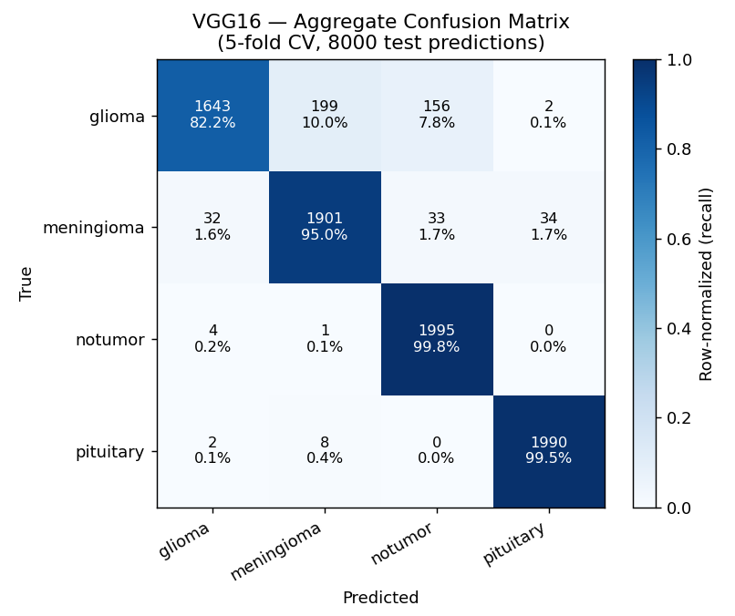

# Phase 1 — VGG16 Baseline

> **Status:** ✅ **Phase 1 complete** — full 5-fold cross-validation executed.
> **Headline:** test accuracy **94.11% ± 0.56%**, macro F1 **94.01% ± 0.59%** (5 folds).
> **Last updated:** 2026-06-02

---

## Goal

Replicate the VGG16 transfer-learning methodology of Wong et al. (2025, PLOS ONE) on the [Brain Tumor MRI Dataset](../methodology/dataset.md), validating that our PyTorch pipeline matches the reported Keras methodology in **statistical behavior**, not in **code**.

This phase is the foundation on which Phase 2 (multi-architecture) and Phase 3 (XAI) will build. It also exercises every component of the infrastructure built in Phase 0 (Postgres, W&B, Kaggle bootstrap, CompositeLogger).

---

## What got built

| Module | Purpose | Lines |
|--------|---------|-------|
| `src/neurolens/config.py` | Pydantic frozen schema with `extra='forbid'` for fail-fast YAML validation | ~110 |
| `src/neurolens/data/dataset.py` | `build_dataset()` over `torchvision.datasets.ImageFolder`, asserts class layout | ~65 |
| `src/neurolens/data/transforms.py` | Train / eval pipelines mirroring Wong et al. augmentation | ~85 |
| `src/neurolens/data/kaggle_paths.py` | Robust dataset-root discovery (handles Kaggle's nested mount layout) | ~70 |
| `src/neurolens/models/vgg16.py` | `build_vgg16(stage)` + `unfreeze_conv5()` helper + Grad-CAM target hook | ~85 |
| `src/neurolens/models/factory.py` | `_MODEL_BUILDERS` registry — Phase 2 will add ResNet50 in one line | ~70 |
| `src/neurolens/training/cv.py` | `stratified_kfold_indices()` over `sklearn.StratifiedKFold(seed=42)` | ~32 |
| `src/neurolens/training/trainer.py` | Training loop with best-only checkpointing and dual-write logging | ~145 |
| `src/neurolens/training/evaluator.py` | Per-class metrics + confusion matrix + raw arrays for downstream XAI | ~75 |
| `src/neurolens/training/run_vgg16.py` | Orchestrates 5-fold CV × 2 stages × evaluation × persistence | ~280 |
| `kernel/runner/run.py` | Kaggle bootstrap: secrets → clone → install → dispatch via `active_run.yaml` | ~110 |
| `tests/` (4 new files) | 31 new unit tests (36 passing in total) | — |

Configuration is fully declarative — five YAML profiles in [`configs/`](../../../configs/) cover the smoke tests and the production run:

- `smoke_micro_stage{1,2}.yaml` — 50 imgs/class × 1 epoch (~90 s, validates plumbing)
- `smoke_small_stage{1,2}.yaml` — full dataset × 2 epochs × 1 fold (~3 min, measures real per-epoch time)
- `vgg16_stage{1,2}.yaml` — production: full dataset × 50 epochs × 5 folds (~5h 25min)

The active profile is selected by [`configs/active_run.yaml`](../../../configs/active_run.yaml), which is the single source of truth read by the Kaggle runner at boot.

---

## Architecture and training setup

See the reference docs for details:

- **Model**: VGG16 + transfer learning + 2-stage training — [`methodology/model.md`](../methodology/model.md)
- **Training**: 5-fold stratified CV, hyperparameters, dual-write tracking — [`methodology/training.md`](../methodology/training.md)
- **Dataset**: 7,200 brain MRI scans, 4 balanced classes — [`methodology/dataset.md`](../methodology/dataset.md)
- **Metrics**: accuracy, F1, confusion matrix — [`methodology/metrics.md`](../methodology/metrics.md)

The full pipeline runs as a single command — the Kaggle runner reads `active_run.yaml`, dispatches into `run_vgg16.main()`, and produces:

- One W&B run per stage per fold (10 runs for the full 5-fold execution)
- One row per training run in PostgreSQL `runs` table
- ~1,600 prediction rows per fold in PostgreSQL `predictions` table (bulk-inserted)
- Best-only checkpoint `.pt` files per stage per fold

---

## Results — full 5-fold cross-validation

All five folds ran end-to-end on a Kaggle T4 GPU (**~5h 11min** total). Each fold's accuracy was independently re-computed from the durable PostgreSQL predictions (`is_correct`) and matched the run log to four decimals — see [Validation and reproducibility](#validation-and-reproducibility).

### Headline (5-fold mean ± std)

| Metric | Value |
|--------|-------|
| **Test accuracy** | **94.11% ± 0.56%** |
| **Macro F1** | **94.01% ± 0.59%** |

### Per-fold results

| Fold | Test accuracy | Macro F1 |
|------|---------------|----------|
| 0 | 0.9431 | 0.9421 |
| 1 | 0.9444 | 0.9436 |
| 2 | 0.9425 | 0.9416 |
| 3 | 0.9444 | 0.9433 |
| 4 | 0.9313 | 0.9297 |

Folds 0–3 cluster tightly around 94.3%; fold 4 sits ~1.3 pp lower — ordinary CV variance, and exactly why the **mean ± std** (not a single split) is the figure we report. The tight **±0.56%** std shows the model generalizes consistently across splits.

### Per-class F1 (5-fold mean ± std)

| Class | F1 |
|-------|-----|
| **pituitary** | **0.9886 ± 0.0069** |
| notumor | 0.9536 ± 0.0034 |
| meningioma | 0.9253 ± 0.0105 |
| **glioma** | **0.8926 ± 0.0077** |

### Confusion matrix (aggregate over the 5 folds, 8000 predictions)



The matrix refines the per-class story:

- **Glioma recall is the weak spot (82.2%).** One in five gliomas is missed — classified as meningioma (10.0%, 199 cases) or notumor (7.8%, 156 cases). Its *precision* stays high (~0.98), so glioma's low F1 is a **recall** problem, not precision.
- **glioma → notumor (156 cases) is the clinically most serious error** — a tumor read as "no tumor" (a false negative for cancer). A priority for the Phase 3 XAI to examine.
- **notumor (99.8%) and pituitary (99.5%) are near-perfect** — consistent/fixed visual cues make a class easy.
- The glioma↔meningioma confusion predicted in [`clinical-context.md`](../methodology/clinical-context.md) is real but **asymmetric** (199 glioma→meningioma vs 32 the reverse).

---

## Comparison with Wong et al. (2025)

| Aspect | Wong et al. (Keras) | NeuroLens (PyTorch) |
|--------|--------------------|----------------------|
| Reported test accuracy | 0.9924 (single split) | **0.9411 ± 0.0056** (5-fold mean) |
| Best validation accuracy | not reported per-stage | ~0.97–0.98 per fold |
| Cross-validation | None (single 80/10/10) | 5-fold stratified |
| Training time | not reported | ~65 min / fold on Kaggle T4 |

We land **~5 pp below** Wong's headline (and ~3 pp below our own 97–99% target). We report this honestly rather than tuning toward it — and the most likely explanation is **not the model but the split**:

- During training, per-fold **validation** accuracy reached **~0.97–0.98** (close to Wong). Only the held-out **test** accuracy drops to ~0.94 — a **validation→test gap of ~3–4 pp**.
- CV validation is drawn from the same `Training/` distribution; the `Testing/` partition is a **separate, held-out source**. The gap reflects a genuine distribution shift between the two partitions, not under-training (train accuracy reached ~0.99).
- **Hypothesis (we cannot verify Wong's exact protocol):** Wong likely used a single random split of the pooled data, making their test set same-distribution as train (easier → higher). We respect the dataset author's `Training/` vs `Testing/` separation — a harder, more honest split. Our number is more conservative and arguably more trustworthy, even if lower.

Two smaller, intentional deviations also contribute (both documented in [`model.md`](../methodology/model.md#methodological-deviations-from-wong-et-al)): Keras vs PyTorch augmentation RNG, and `rescale=1/255` vs ImageNet normalization. The goal is replication of *methodology*, not bit-for-bit reproduction of Keras code.

---

## Per-class analysis

The per-class F1 spread, stable across all 5 folds, is the most informative result:

```
pituitary    0.989  ─┐
notumor      0.954   │
meningioma   0.925   │
glioma       0.893  ─┘   ←  ~10 pp spread (5-fold means)
```

This pattern is not an artifact (it held across every fold) — it reflects the **morphology** of each class:

- **Pituitary** tumors appear in a fixed anatomical location (the sella turcica, at the base of the brain). Their localization is a strong, position-based feature that a CNN learns quickly.
- **Notumor** scans have a distinctive absence of mass effect. The model learns this as a "negative space" pattern.
- **Meningioma** tumors arise from the meninges and typically appear adjacent to the skull. Easier than glioma but more variable than pituitary.
- **Glioma** tumors are the hardest: they can appear anywhere in the brain parenchyma, with diffuse boundaries and variable morphology. There is no single localization cue.

The 10 pp F1 spread between glioma and pituitary is the kind of finding that **Phase 3 (XAI)** is designed to explain visually. Grad-CAM, LIME, and SHAP heatmaps will reveal what regions the model attends to for each class — we expect to see strong, focused attention on the sella turcica for pituitary, and diffuse, possibly misplaced attention for glioma. This is the kind of insight that distinguishes our work from Wong et al., who did not include XAI.

---

## Engineering and operational notes

A few non-trivial engineering decisions were made during Phase 1, recorded here for transparency.

### Universal Kaggle runner (instead of one kernel per job)

The original plan called for separate Kaggle kernels per job type (`train-vgg16`, `train-resnet50`, `xai-batch`). We discovered that every `kaggle kernels push` detaches the kernel's secrets and dataset attachments — a manual re-attachment in the browser UI is required after each push.

To eliminate this friction, we consolidated to a **single universal `neurolens-runner` kernel**. The kernel's `run.py` is ~110 lines: load secrets, clone the repo, install the package, read `configs/active_run.yaml`, dispatch into the right module. **All future model/training/XAI work is via `git push` + clicking "Save & Run All" — no more re-attachments.**

The dispatch logic is a simple `JOB_TYPES` registry; adding a new job type (e.g., `train_resnet50`, `xai_gradcam_batch`) is one dict entry, no `if/elif` proliferation.

### Bulk insertion for predictions

The first design wrote predictions to PostgreSQL one row at a time. With SSL enforced (TLS handshake per connection), this took ~1.2 s per row × 1,600 rows = **~30 minutes per fold** for persistence alone. Switching to `psycopg2.extras.execute_values` — a single round-trip for the entire batch — brings this to **~2 seconds per fold**. A ~900× speedup on a layer that should never bottleneck the experiment.

### Progressive smoke testing

After a costly false start where a 5-fold × 2-epoch "pre-check" ran for ~3 hours due to the SSL bottleneck above, we codified a **progressive smoke-test protocol**:

```
Micro   →  1 fold × 1 epoch × 50 imgs/class    (<2 min)
Small   →  1 fold × 2 epochs × full dataset    (<10 min)
Medium  →  5 folds × 2 epochs × full dataset   (<30 min, only if needed)
Real    →  5 folds × 50 epochs × full dataset  (production)
```

Each level validates a specific layer: micro confirms plumbing, small measures real per-epoch time, medium measures cross-fold variance, real is the production run. **Never skip levels.** This protocol is now project policy.

---

## Phase 1 status: complete

- [x] Full 5-fold cross-validation executed (94.11% ± 0.56%)
- [x] Mean ± std test accuracy + per-class F1 computed
- [x] Aggregate confusion matrix figure generated
- [x] Comparison with Wong et al. (with honest gap analysis)
- [x] Results cross-validated against the durable PostgreSQL source of truth

Phase 1 delivered a correct, durable, reproducible VGG16 baseline. We are **not** chasing further gains here now — the items below are parked with enough context to resume later.

## Future improvements (parked)

Real opportunities to raise the number or deepen the analysis, deliberately deferred so the project can advance to Phase 2. Phase 2 (ResNet50) results may also inform several of them.

1. **Clean meningioma re-evaluation.** ~26% of the meningioma *test* images are synthetic (`Te-aug-me`), and meningioma was the most variable class (±1.05). Re-evaluate on the real-only test subset (exclude `Te-aug-me`) for an honest meningioma F1. → touch points: [`dataset.md` Known limitations](../methodology/dataset.md#known-limitations) + `evaluator.py`.
2. **Investigate the validation→test gap (~3–4 pp).** Confirm whether `Testing/` is a genuinely harder distribution than `Training/` (e.g., compare class-wise intensity/size statistics, or train on a pooled random split and compare). Explains the gap with Wong and is strong material for the final report's critical discussion.
3. **Close the gap to the 97–99% target.** Options to try *after* the multi-architecture comparison: a learning-rate schedule, more epochs with early stopping, unfreezing conv4 in addition to conv5, or test-time augmentation. Resist over-tuning — replication, not SOTA, is the Phase 1 goal.
4. **Glioma recall + the glioma→notumor false negatives.** The 156 gliomas read as "no tumor" are the most clinically serious errors; the Phase 3 XAI should examine what the model attends to on those cases.

Phase 2 (multi-architecture, ResNet50) is the next step — the `_MODEL_BUILDERS` registry in `models/factory.py` makes adding it a one-line change.

---

## Validation and reproducibility

**Dual-source validation.** Every fold's test accuracy was re-computed from the durable PostgreSQL `predictions` table (averaging `is_correct` over each fold's 1,600 rows) and matched the Kaggle run log to four decimals. All 8,000 Phase B predictions (5 × 1,600) were persisted; the dual-write (W&B + PostgreSQL + JSONL) held at production scale.

**Determinism.** Fold 0 of the 5-fold run reproduced the earlier single-fold sanity check exactly (test_acc 0.9431, identical per-class) — the fixed seed (42, set for PyTorch / NumPy / Python `random` at the top of `run_vgg16.main()`) makes the pipeline deterministic. Exact outputs may differ marginally across GPUs (cuDNN nondeterminism), but macro F1 is stable to within ~0.5 pp.

**To reproduce:**

```bash
git clone https://github.com/johancarloss/neurolens.git
cd neurolens
git checkout 79deb0c   # commit with target_fold: null (full 5-fold run)
uv sync --extra dev
# then run on a GPU machine, or push + Save & Run All on the Kaggle runner:
uv run python -m neurolens.training.run_vgg16
```

---

## References

- [Wong et al. (2025)](https://journals.plos.org/plosone/article?id=10.1371/journal.pone.0322624) — methodology being replicated
- [Brain Tumor MRI Dataset](https://www.kaggle.com/datasets/masoudnickparvar/brain-tumor-mri-dataset) — data source
- [methodology/dataset.md](../methodology/dataset.md) — dataset details
- [methodology/model.md](../methodology/model.md) — VGG16 architecture and transfer learning strategy
- [methodology/training.md](../methodology/training.md) — training protocol and infrastructure
- [methodology/metrics.md](../methodology/metrics.md) — definitions of every reported metric
