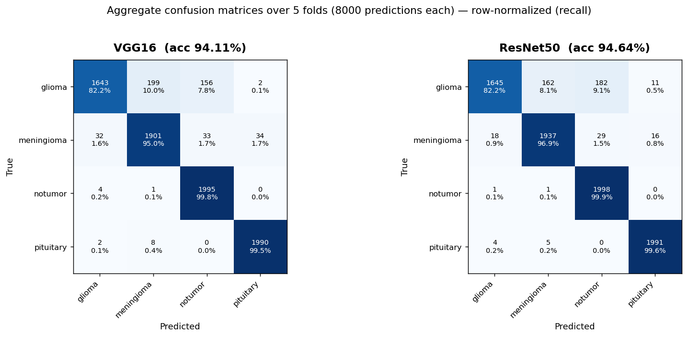

# Phase 2 — Multi-Architecture (VGG16 vs ResNet50)

> **Status:** ✅ **Phase 2 complete** — ResNet50 trained on the same 5-fold protocol and compared against the VGG16 baseline.
> **Headline:** ResNet50 reaches **94.64% ± 0.55%** test accuracy vs VGG16's **94.11% ± 0.56%** — a modest **+0.52 pp** edge, in **19% less training time**.
> **Last updated:** 2026-06-04

---

## Goal

Generalize the system to be **architecture-agnostic** (switching models is a YAML edit, not a code change) and validate it by training **ResNet50** through the exact same pipeline as the Phase 1 VGG16 baseline, then comparing the two fairly.

The objective of this phase was **to make it work and compare honestly**, not to chase a higher number. Hyperparameter tuning is deliberately deferred to the end of the project, when all architectures are on the table.

This phase also builds the bridge to Phase 3 (XAI): the factory now exposes `get_target_layer_for_gradcam(model, "resnet50") → layer4[-1]`, ready for the explainability work.

---

## What got built

| Module | Purpose | Lines |
|--------|---------|-------|
| `src/neurolens/models/resnet50.py` | `build_resnet50(stage)` + `unfreeze_layer4()` + Grad-CAM target hook — mirrors the `vgg16.py` interface | ~75 |
| `src/neurolens/models/factory.py` | Registered `resnet50` in three registries; added `unfreeze_for_stage2(model, arch)` dispatcher | (+40) |
| `src/neurolens/training/run_train.py` | The arch-agnostic runner (extracted from `run_vgg16.py`); the architecture now comes from `config.arch` | ~360 |
| `src/neurolens/training/run_vgg16.py` | Reduced to a re-export shim so the immutable Kaggle kernel keeps working | ~25 |
| `configs/resnet50_stage{1,2}.yaml` | Production profiles (same hyperparameters as VGG16 for a fair comparison) | — |
| `configs/resnet50_smoke_stage{1,2}.yaml` | Micro smoke profiles (1 fold, 1 epoch, capped) | — |
| `tests/test_models_resnet50.py` + `test_models_factory.py` | 12 new unit tests (52 passing in total) | — |
| `scripts/plot_confusion_matrices.py` | Reproducible figure generator (pulls predictions from PostgreSQL) | ~110 |

**Zero changes to `kernel/runner/run.py`.** An entire architecture was added without touching the immutable kernel — see [The arch-agnostic refactor](#engineering-notes-the-arch-agnostic-refactor).

---

## Comparison setup

Both architectures were trained under **identical conditions** so any difference is attributable to the model, not to luck:

- **Same data, same splits.** Both use `StratifiedKFold(n_splits=5, seed=42)` over the same `Training/` partition — fold *k* of ResNet50 sees exactly the same train/validation images as fold *k* of VGG16.
- **Same hyperparameters.** 2-stage training (LR 1e-3 head-only → 1e-4 fine-tune), 50 epochs/stage, batch 32, Adam, same augmentation.
- **Same held-out test set.** The 1,600-image `Testing/` partition, untouched during training.
- **Same infrastructure.** Dual-write to W&B + PostgreSQL + JSONL.

The only differences are intrinsic to the architectures:

| | VGG16 | ResNet50 |
|---|-------|----------|
| Parameters | ~138M | ~25M |
| Head | `Flatten → Linear(25088,256) → ReLU → Dropout → Linear(256,4)` | `Dropout → Linear(2048,4)` |
| Stage-2 unfrozen block | `conv5` (last conv block) | `layer4` (last bottleneck block) |
| Grad-CAM target (Phase 3) | `features[-1]` | `layer4[-1]` |

ResNet50's head is smaller because its global average pooling already collapses each feature map to a single value (2048-d vector), so no flatten or bottleneck layer is needed.

---

## Results — VGG16 vs ResNet50

### Headline (5-fold mean ± std, held-out test set)

| Metric | VGG16 | ResNet50 | Δ |
|--------|-------|----------|---|
| **Test accuracy** | 94.11% ± 0.56% | **94.64% ± 0.55%** | **+0.52 pp** |
| **Macro F1** | 94.01% ± 0.59% | **94.53% ± 0.57%** | +0.52 pp |
| **Training time / fold** | 61.7 min | **50.2 min** | −19% |
| **Total (5 folds)** | 5.14 h | **4.19 h** | −0.95 h |

ResNet50 is **marginally more accurate and meaningfully faster** — the speed comes from having ~5× fewer parameters (global average pooling instead of a 25088-wide flattened head).

### Per-fold results (paired — same splits)

| Fold | VGG16 | ResNet50 | Winner |
|------|-------|----------|--------|
| 0 | 0.9431 | 0.9506 | ResNet50 |
| 1 | 0.9444 | 0.9400 | VGG16 |
| 2 | 0.9425 | 0.9531 | ResNet50 |
| 3 | 0.9444 | 0.9456 | ResNet50 |
| 4 | 0.9313 | 0.9425 | ResNet50 |

**ResNet50 wins 4 of 5 folds.** But the per-fold std bands overlap (VGG16 reaches ~94.67%, ResNet50 dips to ~94.09%), so this is best read as a **small, consistent edge — not a decisive win**. For our balanced 7,200-image dataset, the architecture matters little; both land at ~94%.

### Per-class F1 (5-fold mean ± std)

| Class | VGG16 | ResNet50 | Δ |
|-------|-------|----------|---|
| pituitary | 0.9886 ± 0.0069 | **0.9910 ± 0.0022** | +0.24 |
| notumor | **0.9536 ± 0.0034** | 0.9496 ± 0.0162 | −0.40 |
| meningioma | 0.9253 ± 0.0105 | **0.9437 ± 0.0056** | **+1.84** |
| glioma | 0.8926 ± 0.0077 | 0.8968 ± 0.0114 | +0.42 |

ResNet50's overall gain is **concentrated in meningioma** (+1.84 pp). Glioma stays the hardest class for both, and `notumor` is the one place VGG16 is steadier (ResNet50's notumor F1 is noisier, ±1.62).

### Confusion matrices (aggregate over 5 folds, 8,000 predictions each)



The side-by-side matrices are the most revealing result of the phase.

---

## The key finding: glioma's ceiling is architecture-independent

**Both architectures recall exactly 82.2% of gliomas** — VGG16 gets 1643/2000, ResNet50 gets 1645/2000. Two networks with fundamentally different designs (VGG16's plain convolution stack vs ResNet50's residual connections + batch norm) hit the **same** glioma ceiling, independently.

When two independent experiments fail in the same place, the conclusion shifts from *"model X has a weakness"* to **"the difficulty is in the data/problem, not the architecture."** This directly corroborates the Phase 1 finding (glioma recall is the bottleneck) and confirms glioma as the right target for the Phase 3 XAI — we will *see* why both models confuse it.

**An honest nuance — higher accuracy is not automatically safer.** The two models distribute their glioma errors differently:

| Glioma misread as… | VGG16 | ResNet50 |
|---------------------|-------|----------|
| meningioma | 199 (10.0%) | 162 (8.1%) |
| **notumor** (false negative for cancer) | 156 (7.8%) | **182 (9.1%)** |

ResNet50, despite its higher overall accuracy, makes **more** of the clinically most serious error — reading a glioma as "no tumor" (182 vs 156). A model-selection decision for a medical tool cannot rest on accuracy alone; the cost of a missed tumor outweighs the cost of a misclassified-but-detected one. This is exactly the kind of trade-off the Phase 3 XAI is meant to illuminate.

The easy classes stay easy for both: `notumor` (99.8% / 99.9%) and `pituitary` (99.5% / 99.6%) are near-perfect, driven by fixed, learnable visual cues (mass-effect absence; the sella turcica location).

---

## Engineering notes: the arch-agnostic refactor

The Phase 1 `run_vgg16.py` looked generic but had three VGG16-specific couplings that would have crashed ResNet50. Removing them — without touching the immutable Kaggle kernel — was the core engineering of this phase.

1. **Stage-1 optimizer** targeted `model.classifier.parameters()` (a VGG16-only attribute; ResNet50's head is `model.fc`). Replaced with `[p for p in model.parameters() if p.requires_grad]` — provably identical for VGG16 (only the head is unfrozen in stage 1) and arch-agnostic.
2. **Stage-1→2 transition** called `unfreeze_conv5(model)` directly. Replaced with `unfreeze_for_stage2(model, arch)`, which the factory dispatches to `conv5` (VGG16) or `layer4` (ResNet50).
3. **Run naming** hardcoded `"vgg16"` in W&B groups, experiment names, and checkpoint paths. Parametrized by `config.arch` so the two architectures never collide.

The logic moved to an arch-agnostic `run_train.py`; `run_vgg16.py` became a 25-line re-export shim. The Kaggle runner kernel imports `neurolens.training.run_vgg16` from its baked-in registry, and re-pushing the kernel would detach its secrets — so the shim keeps the kernel working unchanged while the code stays honest about what the runner does. **Adding ResNet50 required zero kernel changes**: just `git push` + "Save & Run All" with `config_profile: resnet50`.

The full test suite (52 tests) stayed green throughout, confirming the refactor introduced no VGG16 regression.

---

## Phase 2 status: complete

- [x] `build_model("resnet50")` functional via the factory
- [x] Runner generalized to arch-agnostic (`run_train.py`) with no VGG16 regression
- [x] ResNet50 trained on the full 5-fold protocol (94.64% ± 0.55%)
- [x] Fair comparison table (accuracy, macro F1, per-class F1, training time)
- [x] Side-by-side confusion matrices generated from the durable PostgreSQL source
- [x] Results cross-validated against PostgreSQL (VGG16 recomputed to 94.11%, matching the published Phase 1 figure)

## Future improvements (parked)

Deliberately deferred so the project can advance to Phase 3 (XAI):

1. **EfficientNet-B0 as a third architecture.** The factory makes it a ~3-line addition (one entry per registry). Skipped here to avoid delaying Phase 3; a natural extension if time allows.
2. **Statistical significance of the +0.52 pp edge.** A paired test across the 5 folds (the splits are identical) would quantify whether ResNet50's advantage is significant or within noise. Material for the final report's discussion.
3. **The glioma→notumor trade-off.** ResNet50's higher rate of the dangerous false negative (182 vs 156) deserves a per-case look in Phase 3 — are these the same hard images both models miss, or different ones?
4. **ResNet50 + frozen BatchNorm.** With the backbone frozen in stage 1, ResNet50's BatchNorm running statistics still update in `train()` mode, which can subtly hurt frozen-backbone transfer learning. Freezing BN in eval mode during stage 1 is a known refinement worth testing.

---

## Validation and reproducibility

**Dual-source validation.** Every fold's metrics were re-computed from the durable PostgreSQL `predictions` table (8,000 rows per architecture) and matched the run logs. As a cross-check, the VGG16 baseline was recomputed from PostgreSQL and reproduced the published Phase 1 headline of **94.11%** exactly — confirming the comparison uses the correct runs.

**Determinism.** Both architectures use seed 42 (PyTorch / NumPy / Python `random`), so the 5-fold splits are identical across architectures — the requirement for a fair paired comparison.

**To reproduce:**

```bash
git clone https://github.com/johancarloss/neurolens.git
cd neurolens
uv sync --extra dev
# Set configs/active_run.yaml -> config_profile: resnet50, then push + Save & Run All
# on the Kaggle runner, or run locally on a GPU:
uv run python -m neurolens.training.run_train
# Regenerate the comparison figure from PostgreSQL:
uv run python scripts/plot_confusion_matrices.py
```

---

## References

- [Phase 1 — VGG16 Baseline](phase-1-vgg16-baseline.md) — the baseline being compared against
- [methodology/model.md](../methodology/model.md) — transfer-learning strategy (both architectures)
- [methodology/training.md](../methodology/training.md) — training protocol and dual-write infrastructure
- [methodology/metrics.md](../methodology/metrics.md) — definitions of every reported metric
- [He et al. (2016)](https://arxiv.org/abs/1512.03385) — Deep Residual Learning (ResNet)
- [Brain Tumor MRI Dataset](https://www.kaggle.com/datasets/masoudnickparvar/brain-tumor-mri-dataset) — data source
