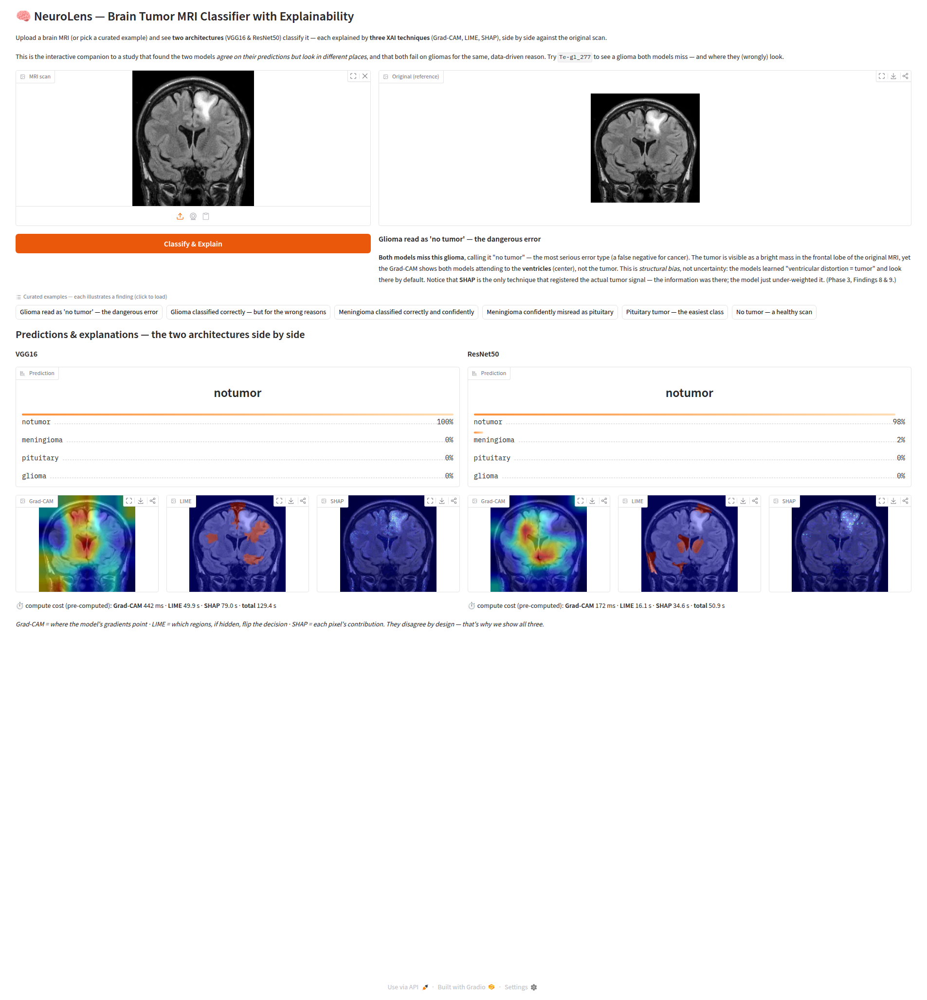
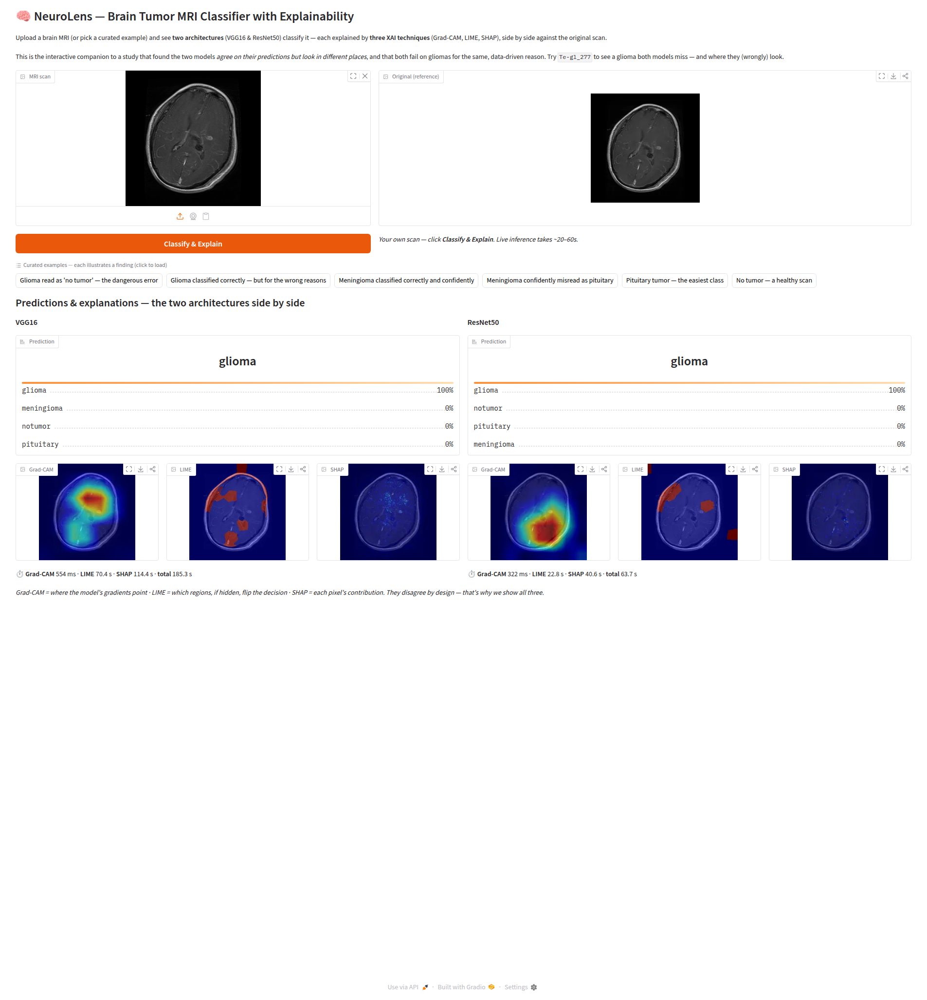

# Phase 4 — Interactive Demo (Gradio)

> **Status:** ✅ **Phase 4 complete** — an interactive demo that runs both trained architectures and all three XAI techniques on one scan, side by side.
> **Headline:** the demo is not a generic classifier front-end — it is a **narrated showcase of the Phase 3 findings**. Six curated cases open instantly (pre-computed) and each one carries the finding it materialises; free uploads run live.
> **Last updated:** 2026-07-18

---

## Goal

Phases 1–3 produced numbers and figures. Phase 4 turns them into something a
person can *operate*: upload a brain MRI (or pick a curated case) and watch
**VGG16 and ResNet50 classify it side by side**, each explained by **Grad-CAM,
LIME and SHAP**, always next to the original scan.

Two Phase 3 results shaped the design:

- **Both architectures are shown, not "the best one".** Phase 2 found a
  statistical tie (94.11% vs 94.64%) and Phase 3 found that the two models
  *agree on the class but look in different places*. Showing one would hide half
  the result.
- **The original MRI sits beside every overlay.** Phase 3's meta-lesson
  (Finding 11) was that a saliency map without its reference image misleads — a
  large red blob reads as "uncertain" until you can see it is in the wrong place.

---

## What got built

| Module | Purpose |
|--------|---------|
| `src/neurolens/ui/inference.py` | `NeuroLensInference` — loads both models + the six explainers once, exposes a single `explain(image)` returning predictions and overlays for both architectures |
| `src/neurolens/ui/visualize.py` | Shared overlay helpers (`overlay_saliency`, `lime_mask_to_map`) — the same blending used by the Phase 3 batch pipeline |
| `src/neurolens/ui/precompute.py` | Persist/restore an `ExplainResult` to disk (PNG overlays + JSON numbers) — the cache behind the instant examples |
| `src/neurolens/ui/gradio_app.py` | The interface: two architectures in parallel columns, shared original, curated examples with narrative, per-technique compute times |
| `scripts/run_demo.py` | Local CLI (`--port`, `--share`, `--lime-samples`) |
| `scripts/precompute_examples.py` | Offline generation of the curated examples' overlays |
| `scripts/deploy_hf_space.py` + `hf-space/` | Self-contained HuggingFace Space package (see *Deployment* below) |
| `docs/public/demo-examples/` | 6 curated scans + `examples.yaml` (narrative per case) + `precomputed/` (42 PNGs + 6 JSON) |
| `tests/test_ui_*.py` | 10 new unit tests (92 collected: 91 passing, 1 skipped) |

The three explainers, the model factory and the transforms were **reused
unchanged** from Phases 1–3 — Phase 4 added no XAI logic.

---

## How it works

The design separates **logic from interface**, so the expensive part is testable
without launching a UI:

```
      image (numpy)
           │
           ▼
   ┌───────────────────┐   loaded once at boot:
   │ NeuroLensInference│   2 models + 6 explainers + SHAP background
   └───────────────────┘
           │  per architecture: softmax → Grad-CAM → LIME → SHAP → overlays
           ▼
   ExplainResult(original, per_arch{probs, 3 overlays, times})
           │
           ▼
   ┌───────────────────┐
   │    gradio_app     │   thin shell: flattens the result into widgets
   └───────────────────┘
```

**Curated examples are pre-computed; uploads are live.** A full explanation is
~4 minutes on CPU (LIME and SHAP dominate), which is unusable for a showcase. So
the six curated cases were computed once, offline, and their overlays are served
from disk — they open in under a second. A hidden field carries the selected
example's id, so the app knows to load the cache; a free upload clears that field
and computes live. The two paths are deliberately distinguishable: pre-computed
results label their timings as *compute cost*, live runs do not.

---

## What it looks like



*A curated case (`Te-gl_277`). Both models say **notumor** (100% / 98%) while
Grad-CAM lights up the **ventricles** rather than the frontal-lobe tumour visible
in the reference scan — [Finding 8](phase-3-xai.md) reproduced live.*



*A free upload (a held-out glioma). Both architectures classify it correctly at
100%, and the timings show the real cost of a live explanation.*

---

## Measured performance

Times from the demo itself, on the CPU of a small VPS (no GPU):

| Path | VGG16 | ResNet50 | User wait |
|------|-------|----------|-----------|
| Curated example (cached) | — | — | **< 1 s** |
| Live upload | Grad-CAM 554 ms · LIME 70.4 s · SHAP 114.4 s · **total 185 s** | Grad-CAM 322 ms · LIME 22.8 s · SHAP 40.6 s · **total 64 s** | **~4 min** |

Two things worth reading off that table:

- **Explaining costs orders of magnitude more than predicting.** Grad-CAM is one
  forward + one backward pass (sub-second); LIME runs the model 200 times and
  SHAP integrates gradients against a background set. The classification itself
  is a rounding error next to its explanation.
- **VGG16 is markedly slower than ResNet50** on the same work (~3× here),
  consistent with its ~5× larger parameter count.

---

## Deployment — and why the demo runs locally

The Phase 4 plan treated a public HuggingFace Space as the **anchor
deliverable**. That assumption did not survive contact with reality: creating the
Space now returns

```
402 Payment Required — "Static Spaces are free for everyone, but hosting Gradio
and Docker Spaces on free cpu-basic requires a PRO subscription."
```

HuggingFace changed its pricing after the plan was written. Alternatives were
weighed (PRO subscription, a static gallery-only Space, self-hosting behind a
free subdomain, a temporary Gradio tunnel) and the decision was to **run the demo
locally** — for a defence, screen-sharing a working demo is equivalent, and the
public artefacts (this repository, its methodology write-ups and figures) already
carry the scientific content.

The deployment package was kept, complete and validated: `hf-space/`
(entrypoint, lean requirements, Space README) plus `scripts/deploy_hf_space.py`,
which assembles a self-contained Space (vendored package + checkpoints + curated
examples + a mini SHAP background) and uploads it. It was smoke-tested end to end
locally; only the final upload is gated by the paywall.

---

## How to run it

```bash
uv run python scripts/run_demo.py            # http://127.0.0.1:7860
uv run python scripts/run_demo.py --share    # temporary public tunnel (72h)
```

Re-generating the curated examples (after changing models or examples):

```bash
uv run python scripts/precompute_examples.py
```

---

## Limitations

- **CPU-bound live inference.** A free upload takes minutes; only the curated
  cases are instant. Nothing here is optimised (no quantisation, no ONNX) — out
  of scope by design.
- **The demo does not persist anything.** Unlike training, there is no
  dual-write; it is pure inference.
- **Six curated cases, not eight to ten.** Enough to cover the findings worth
  narrating without diluting them.
- **Not a clinical tool.** The same caveat as every other phase: this is a
  research baseline, and Phase 3 showed the models can be right for the wrong
  reasons.
